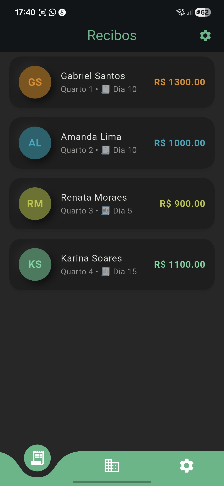
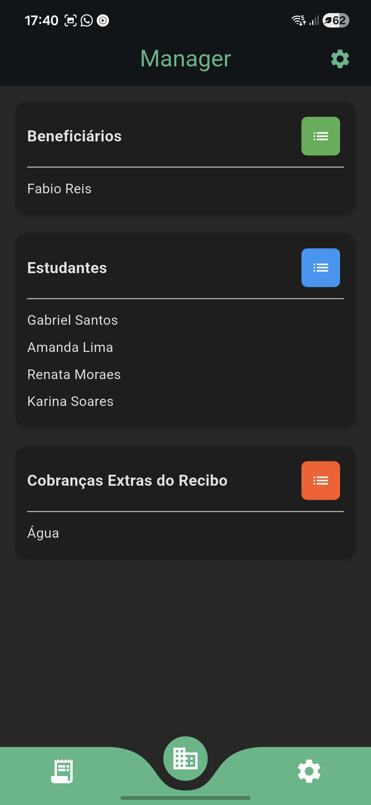
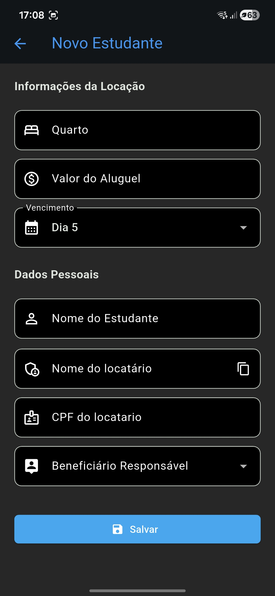
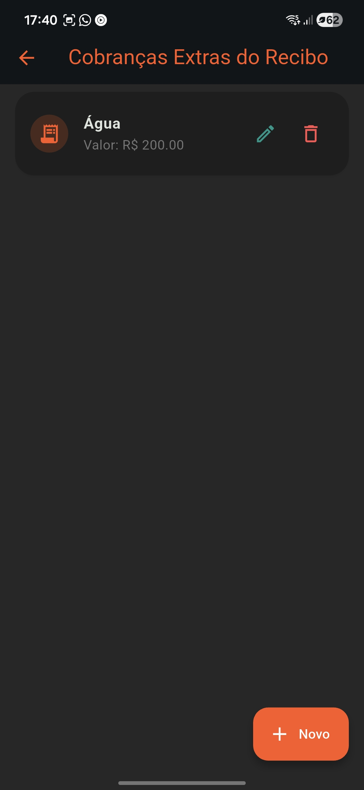
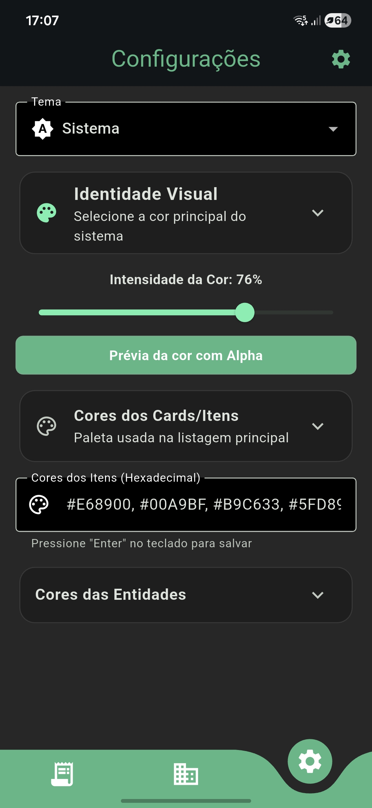
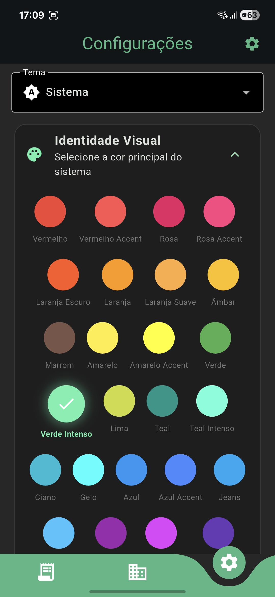
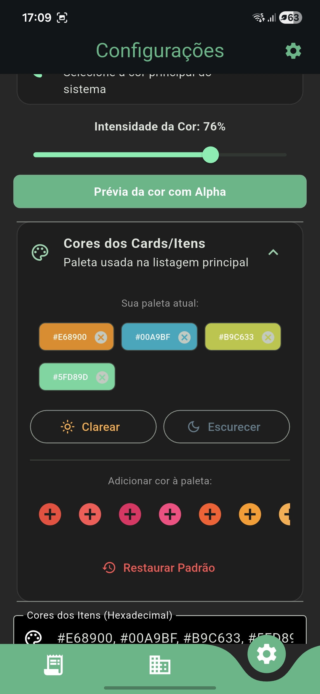
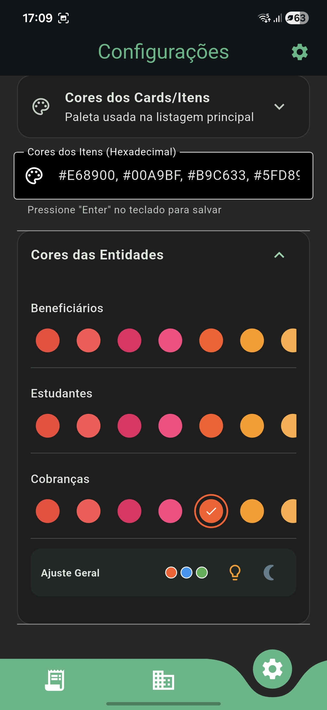

# 📄 Rental Manager

> Aplicativo mobile de gerenciamento de locações desenvolvido com **Flutter** para organizar contratos, pagamentos e emissões de recibos de forma simples.

---

## 📱 Sobre o Projeto

O **Rental Manager** é uma aplicação criada para facilitar o gerenciamento de locações, projetado para lidar com as particularidades de kitnets e moradias estudantis. O diferencial do projeto é a flexibilidade no controle de custos fixos e variáveis, além de uma gestão precisa de quem emite e quem recebe os pagamentos.

O projeto foi publicado no GitHub já em sua versão funcional.

* * *

🚀 Engenharia e Regras de Negócio

* **Gestão de Entidades:**
  
  * **Cadastro de Estudantes:** Gestão específica para o público universitário/estudantil.
    
  * **Gestão de Beneficiários:** Flexibilidade para definir quem consta como emissor no recibo oficial.
    
* **Lógica de Cobrança de Excedentes:**
  
  * Implementação de algoritmos para cálculo de **taxas extras (água, luz, etc.)** baseados em consumo excedente, integrados automaticamente ao valor final do recibo.
* **Persistência e Arquitetura:**
  
  * **SQLite (sqflite):** Armazenamento relacional para as entidades de Beneficiários, Estudantes e o histórico de Cobranças.
    
  * **Padrão IRepository:** Camada de abstração que desacopla a lógica de negócio do banco de dados, facilitando a manutenção e garantindo a inversão de dependência.
    
  * **SharedPreferences:** Utilizado para configurações rápidas e persistência de estados de sessão.
    

* * *

🛠️ Tecnologias Utilizadas

* **Linguagem:** Dart
  
* **Framework:** Flutter
  
* **Banco de Dados:** SQLite (`sqflite`) para dados relacionais.
  
* **Preferências:** `shared_preferences` para configurações de usuário.
  
* **Geração de PDF:** Layouts customizados para recibos detalhados.
  
* **Arquitetura:** Interface-based Repository Pattern e princípios SOLID.
  

* * *

📸 Funcionalidades em Destaque
------------------------------

## Recibos

## Inclusão de Beneficiários e Estudantes

## Fluxo de Gerenciamento de Cobranças Extras (como Beneficiários e Estudantes)

# Configurações

* * *

📄 Sobre este Repositório

Este é um repositório de **Showcase**. O código-fonte é mantido de forma privada para proteção da propriedade intelectual. No entanto, sinta-se à vontade para entrar em contato para discutirmos a implementação técnica das regras de negócio ou a arquitetura de persistência utilizada.
